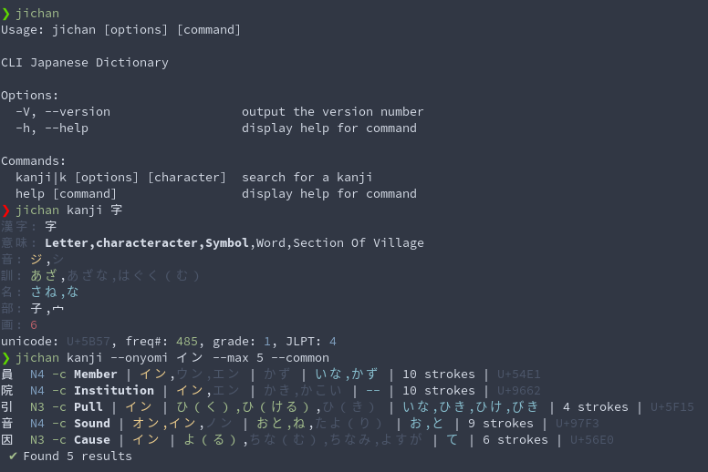

# JiChan

Preview:



Jicahn is a CLI japanese ictionary, it's currently only providing kanji search. This project is currently not my priority but I'll implement JMDict database later on, PRs are also welcome.

This app uses the Kanjidic2 database with some additional informations such as common readings, updated JLPT levels and only features 6355 kanji (JIS X 0208-1998). You can get the database from [this repository](https://github.com/luckasRanarison/jichan-db), this is a converted version of the JSON database in sqlite and Jichan uses Sequelize-Typescript for ORM.

# Build

To build the app you just have to run the build.sh scirpt, it will also fetch the database.

```
bash build.sh
```

**Notes:**

-   Only tested on linux and also may not work properly on windows.
-   Database bundling is not implemented yet.
